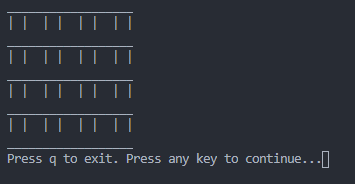
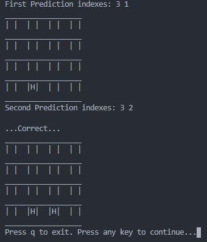
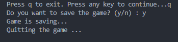
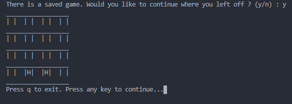

# MemoryGame
> Memory game in Java using arrays and Serializable interface

[![Java version][java-image]][java-url]
[![Jdk version][jdk-image]][jdk-url]

[java-image]: https://img.shields.io/badge/java-v15.0.1-orange
[java-url]: https://www.java.com/tr/
[jdk-image]: https://img.shields.io/badge/jdk-v15.0.1-green
[jdk-url]: https://www.oracle.com/tr/java/technologies/javase-jdk15-downloads.html

## Usage example

When you run the program you will see the game board. Like this:

Since the game board has a 4 x 4 matrix, you should enter a value between 0 and 3 with one space for each prediction.

If you want to exit the game just press 'q'.

Then you can continue playing the game again where you left off.

You can play the game as you wish by changing the letters on the game board yourself.

Have a nice game. :)

If you run into a problem, you can let me know here or on my Twitter account. - @Mehmetkaragoz07 - karagoz.mhmtg@gmail.com

https://github.com/mehmet-karagoz
